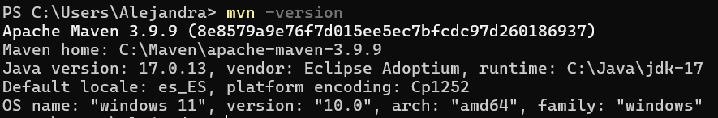
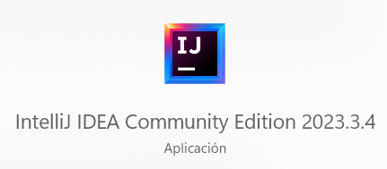

# Práctica 1 - Alejandra Botín

## Primera Parte

### Introducción

En esta práctica hemos trabajado con Git y GitHub para gestionar un repositorio de código y entender los conceptos básicos de control de versiones. Comenzamos haciendo un fork de un repositorio en GitHub para crear una copia en nuestra cuenta, y luego lo clonamos en nuestro entorno local utilizando GitHub Codespaces. Desde allí, editamos archivos como el `README.md`, utilizando comandos fundamentales de Git como `git clone`, `git status`, `git add`, `git commit`, `git push` y `git checkout`.

A continuación, se muestra el uso de estos comandos y qué hace cada uno en cada caso:

---

### Git Clone

- El comando descarga una copia completa del repositorio remoto `p1-fork` desde GitHub al entorno de trabajo (en este caso, Codespaces). Esto incluye todo el historial del repositorio y su contenido actual, creando una carpeta llamada `p1-fork` donde se almacena el proyecto.

---

### Git Status

- El comando `git status` muestra el estado actual del repositorio. En este caso:
  - **On branch main**: Trabajamos en la rama principal `main`.
  - **Your branch is up to date with 'origin/main'**: La rama local está sincronizada con la rama remota en GitHub.
  - **Untracked files**: La carpeta `p1-fork/` no está rastreada porque no se ha añadido al área de preparación (staging area). Para rastrearlos, se usa a continuación `git add`.

---

### Git Add

- Después de ejecutar el comando `git add README.md`, se incluyó el archivo `README.md` en el área de preparación (staging area). El comando `git status` mostró los cambios preparados y no preparados. Específicamente:

  1. **Cambios preparados para confirmar (Changes to be committed):**
     - `deleted: README.md`: El archivo `README.md` se marcó como eliminado en el área de preparación.
     - `new file: p1-fork`: La carpeta `p1-fork` fue detectada como un nuevo archivo o directorio.
  2. **Cambios no preparados para confirmar (Changes not staged for commit):**
     - `modified: p1-fork`: El contenido de la carpeta `p1-fork` había sido modificado, pero aún no estaba incluido en el área de preparación.

Después, se ejecutó el comando `git add .`, que agrega todos los archivos y carpetas modificados o no rastreados (untracked) al área de preparación.

---

### Git Commit

- El comando `git commit -m "Descripción de los cambios realizados"` ha registrado oficialmente los cambios en el historial del repositorio local, acompañado de un mensaje descriptivo. El terminal indicó:
  - **[main 3c823cf] Descripción de los cambios realizados**:
    - El commit se realizó en la rama `main` y está identificado con el hash único `3c823cf`.
  - **2 files changed, 1 insertion(+), 24 deletions(-)**:
    - Se realizaron cambios en dos archivos.
    - Hubo 1 línea añadida y 24 líneas eliminadas.
  - **Detalles de los archivos**:
    - `delete mode 100644 README.md`: El archivo `README.md` fue eliminado porque al clonar la carpeta lo teníamos dos veces.
    - `create mode 160000 p1-fork`: La carpeta `p1-fork` fue añadida al repositorio como un nuevo archivo o directorio.

---

### Git Push

- El comando `git push origin main` ha subido los cambios confirmados desde el repositorio local al repositorio remoto en GitHub. Aquí está el desglose:
  - **Enumerating objects**:
    - Git contó los cambios realizados y confirmados (en este caso, 3 objetos, que incluyen las modificaciones y metadatos relacionados).
  - **Counting objects y Writing objects**:
    - Los objetos fueron empaquetados (comprimidos) y enviados al servidor remoto (GitHub).
    - La transferencia fue exitosa con un total de 259 bytes.
  - **To https://github.com/AlejandraBotin/p1-fork**:
    - Esto confirma que los cambios se subieron correctamente al repositorio remoto alojado en la URL proporcionada.
  - **07720b5..3c823cf main -> main**:
    - Muestra el rango de commits que se subieron, indicando que los cambios realizados en el commit `3c823cf` ya están disponibles en la rama `main` del repositorio remoto.

---

### Git Checkout

- El comando `git checkout -b mi-nueva-rama` ha creado una nueva rama llamada `mi-nueva-rama` y automáticamente ha cambiado a esa rama. Aquí está el desglose:
  - `git checkout -b mi-nueva-rama`:
    - `-b` indica que se debe crear una nueva rama.
    - `mi-nueva-rama` es el nombre de la nueva rama.
  - **Switched to a new branch 'mi-nueva-rama'**:
    - Confirma que la nueva rama fue creada correctamente y que ahora estás trabajando en esa rama.
  - `(mi-nueva-rama)` en la línea de comandos:
    - Indica que ahora estamos en la rama `mi-nueva-rama`, en lugar de la rama `main`.

---

## Conclusión

El ejercicio permitió entender el flujo básico de trabajo con Git, desde la creación de un fork, la clonación de un repositorio y la gestión de archivos y ramas, hasta la sincronización de cambios entre el repositorio local y remoto. Esto nos proporciona una base sólida para gestionar proyectos de manera organizada, realizar cambios de forma segura y facilitar la colaboración con otros desarrolladores. La experiencia destaca la importancia de documentar y estructurar adecuadamente los cambios realizados, lo que es esencial para un desarrollo eficiente y transparente.

---

## Segunda Parte

### Java 17

---

### Maven

---

### VSCode

---

### IntelliJ

